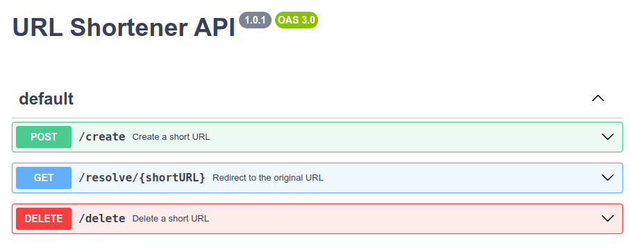

# Servicio de Acortador de URL

## Índice

- [Arquitectura y Tecnologías](#arquitectura-y-tecnologías)
  - [Base de Datos](#base-de-datos)
  - [APIs](#apis)
  - [Observabilidad](#observabilidad)
  - [Caché](#caché)
- [Flujo Básico](#flujo-básico)
  - [Acortar URL](#acortar-url)
  - [Recuperar URL](#recuperar-url)
  - [Eliminar URL](#eliminar-url)
- [Manual de pruebas](#manual-de-pruebas)
  - [Acortar URL](#acortar-url)
## Arquitectura y Tecnologías

### Base de Datos
Por ahora esta proyectado usar AWS DynamoDB por velocidad y escalabilidad. Dynamo serverless escala automaticamente y rapido, lo que lo convierte en una opción adecuada para un servicio muy concurrente donde el rendimiento y la escalabilidad son factores clave.

### APIs
Para los endpoints de la API, decidí usar funciones Lambda en AWS escritas en Go. Los beneficios de rendimiento de Go y la facilidad de implementación en Lambda usando serverless framework lo convirtieron en una opción ideal. Las funciones Lambda son responsables de acortar y recuperar URLs.

### Observabilidad
Usaremos AWS CloudWatch para monitorear métricas básicas y configurar alertas.

### Caché
Para reducir la latencia, pense en usar AWS ElastiCache con Redis. Almacena URLs accedidas con frecuencia, lo que acelera su recuperación.

## Flujo Básico

### Acortar URL
Cuando se recibe una solicitud para acortar una URL, una función Lambda genera un identificador corto único, guarda la URL completa y el identificador corto en DynamoDB, y luego devuelve la URL acortada.

### Recuperar URL
Al recibir una URL acortada, el sistema primero verifica la caché. Si no se encuentra, realiza una consulta en DynamoDB y redirige a la URL larga original.

### Eliminar URL
Eliminar una URL acortada es sencillo: simplemente se elimina el registro correspondiente en DynamoDB.

## Manual de pruebas

### Descargar el repositorio
git clone https://github.com/germanpages/MeLi-Shortener.git

### Ejecutar
go run src/main.go

### Uso de la api
En https://editor.swagger.io/ puede colocar nuestro openapi.yaml y ver la especificación.

