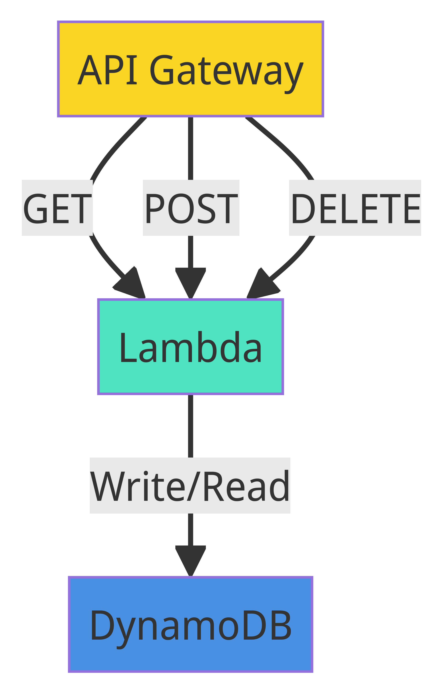

# Servicio de Acortador de URL


## Índice

- [Arquitectura y Tecnologías](#arquitectura-y-tecnologías)
  - [Base de Datos](#base-de-datos)
  - [APIs](#apis)
  - [Observabilidad](#observabilidad)
  - [Caché](#caché)
- [Flujo Básico](#flujo-básico)
  - [Acortar URL](#acortar-url)
  - [Recuperar URL](#recuperar-url)
  - [Eliminar URL](#eliminar-url)
  - [Arquitectura AWS](#arquitecturaaws)
- [Manual de pruebas](#manual-de-pruebas)
  - [Descargar el repositorio](#descargar-el-repositorio)
  - [Ejecutar](#ejecutar)
  - [Uso de la api](#uso-de-la-api)
- [Estrategia de Almacenamiento en DynamoDB](#estrategia-de-almacenamiento-en-dynamodb)
- [Manejo de Git y GitHub](./doc/GIT%20y%20GITHUB.md)
- [Configuración del settings.yml](./doc/settings-yml-documentation.md)

## Arquitectura y Tecnologías

### `Base de Datos`

Por ahora esta proyectado usar AWS DynamoDB por velocidad y escalabilidad. Dynamo serverless escala automáticamente y rápido, lo que lo convierte en una opción adecuada para un servicio muy concurrente donde el rendimiento y la escalabilidad son factores clave.

### `APIs`

Para los endpoints de la API, decidí usar funciones Lambda en AWS escritas en Go. Los beneficios de rendimiento de Go y la facilidad de implementación en Lambda usando serverless framework lo convirtieron en una opción ideal. Las funciones Lambda son responsables de acortar y recuperar URLs.

### `Observabilidad`

Usaremos AWS CloudWatch para monitorear métricas básicas y configurar alertas.

### `Caché`

Para reducir la latencia, pensé en usar AWS ElastiCache con Redis. Almacena URLs accedidas con frecuencia, lo que acelera su recuperación.

## Flujo Básico

### `Acortar URL`

Cuando se recibe una solicitud para acortar una URL, una función Lambda genera un identificador corto único, guarda la URL completa y el identificador corto en DynamoDB, y luego devuelve la URL acortada.

### `Recuperar URL`

Al recibir una URL acortada, el sistema primero verifica la caché. Si no se encuentra, realiza una consulta en DynamoDB y redirige a la URL larga original.

### `Eliminar URL`

Eliminar una URL acortada es sencillo: simplemente se elimina el registro correspondiente en DynamoDB.

### `Arquitectura AWS`



## Manual de pruebas

### `Descargar el repositorio`

```bash
git clone https://github.com/germanpages/MeLi-Shortener.git
```

### `Ejecutar`

```bash
go run src/main.go
```

### `Uso de la api`

En [editor.swagger.io](https://editor.swagger.io/) puede colocar nuestro openapi.yaml y ver la especificación.


## Estrategia de Almacenamiento en DynamoDB

Para el almacenamiento eficaz de las URLs largas y cortas, se ha seleccionado Amazon DynamoDB debido a su capacidad para manejar grandes volúmenes de datos y tráfico, junto con su baja latencia en las operaciones de lectura y escritura.

### `Diseño de la Tabla`

Se diseñará una tabla llamada `UrlShortener` con la siguiente estructura:

| shortUrl (PK) | longUrl         |
|---------------|-----------------|
| me.li/XXYYZZ  | https://eletronicos.mercadolivre.com.br/seguranca-casa/#menu=categories |
| ...           | ...             |

- **shortUrl (PK):** Esta es la clave primaria de la tabla y contiene la URL corta generada. Cada URL corta será única.
- **longUrl:** Este atributo contiene la URL original larga que se desea acortar.

## Operaciones Comunes

1. **Acortar URLs Largas:**
   - Se genera una nueva URL corta y se verifica que no exista en la tabla.
   - Una vez verificada, se inserta una nueva entrada en la tabla con la URL corta como la clave primaria y la URL larga como un atributo.

2. **Obtener la URL Original de una URL Acortada:**
   - Se consulta la tabla usando la URL corta como la clave primaria para obtener la URL larga correspondiente.

3. **Borrado de URLs Cortas:**
   - Se proporciona una API para eliminar una URL corta específica de la tabla si ya no es necesaria.

## Configuración del Repositorio (`settings.yml`)

### `repository`

- Nombre: `MeLi-Shortener`.
- Descripción: "Servicio de Acortador de URL para MercadoLibre".
- Temas: url-shortener, golang, aws, serverless.
- Visibilidad: Pública.
- Issues: Habilitados.
- Proyectos: Habilitados.
- Wiki: Deshabilitada.

### `branches`

- Nombre: `main`.
- Protección: Revisiones requeridas en PRs, checks necesarios antes de mergear.

### `labels`

- Etiquetas: bug, feature, Proveedores Externos, Meli.

### `collaborators`

- Colaborador: `germanpages` con permiso de administrador.

### `code_owners`

- Dueño de código para todos los archivos: `@germanpages`.
